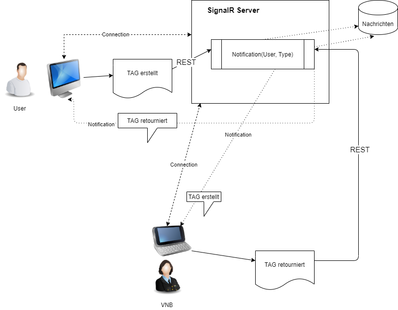
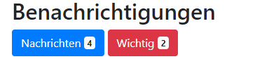

# Technische Umsetzung für Benachrichtigungen

Dieses Dokument beschreibt die technische Umsetzung für das Brunner Informatik Benachrichtigungs-System.  
Auslösende Ereignisse werden intern in der Datenbank gespeichert und auf dem GUI angezeigt.   
Ereignisse werden auch auf andern Kanälen per gewünschter Konfiguration versendet  
z.B. E-Mail, Whatsapp, Teams, Telegramm, Push-Nachrichten.

## Server für interne Nachrichten

    

1. SignalR Server
  Der SignalR Server stellt eine persistente Verbindung zu  Clients mittels Websockets bereit.  
  SignalR ist standardmässig in .NET Core integriert.    
  Server können Mitteilungen an die verbundenen Clients in Real-Time pushen, d.h. sofort und ohne dass der Client zuerst eine Anfrage senden muss. Das GUI wird automatisch aktualisiert mittels Subscription.

2. Web Push Notifications (WPN)   
  Web Push Notifications für wichtige Nachrichten versenden, 
  die auf dem Desktop des Users angezeigt werden, auch wenn der User nicht auf der Website ist oder den Browser geöffnet hat.
   
## App
- Angular Package @microsoft/signalr 
- Der Client registriert sich mittels Subscription beim Server. 

- Benachrichtigungs-Posteingang: 
  - Anzeige Button mit Badge mit der Anzahl ungelesener Nachrichten
  - Klick darauf öffnet den Posteingang mit den ungelesenen Nachrichten fett 
    dargestellt (Ähnlich einem Mail-Clienten), absteigend nach Datum
    - im Titel steht Datum,  Absender und der Meldungs-Gegenstand (z.B. Formular-Titel)
    - der Benachrichtigungs Body enthält einen Link zum Benachrichtigungs-Gegenstand, z.B auf das Formular  
    - Es gibt einen "Antworten" Button, um eine Textmitteilung zurücksenden, z.B. für Rückfragen
  - "Beobachten"-Funktion falls mich etwas interessiert und eine separate Anzeige.

         
  
- Benachrichtigungs-Postausgang
  - Ereignisse, die ich selbst auslgeöst habe, können im Postausgang eingesehen werden.
  - dient als Protokoll was der Benutzer gemacht hat
  - Link im Benachrichtigungs Body, z.B auf das Formular  

  
## Email versenden
  
- Versand von Emails über Email-Service
  - SendGRID Nuget Package
  - C# client library and examples for using Twilio SendGrid API's to send mail and access Web API v3 endpoints with .NET Standard 1.3 and .NET Core support.
  

